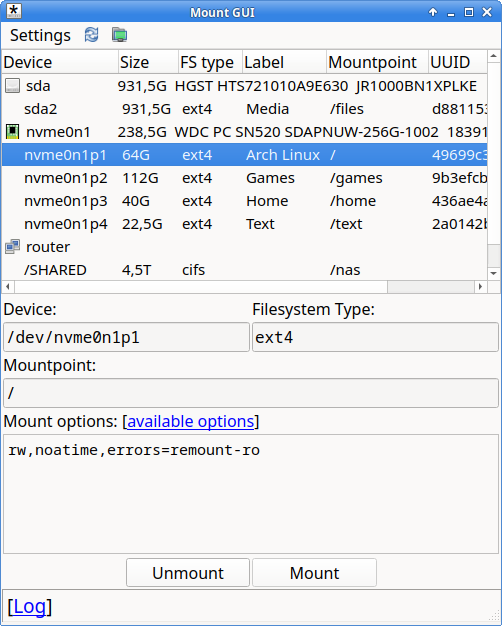
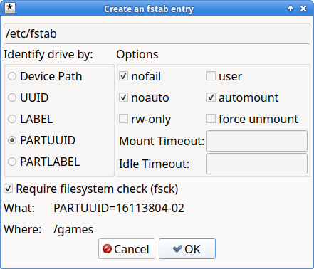

# Mount-GUI

 

- Quickly mount anything, anywhere, with any options.
- Save default options for the file systems and devices.
- Scan local networks for shared folders with Nmap, Avahi, and Windows Service Discovery.
- Easily create *fstab* entries and *systemd* mount units.
- Discover and mount MTP devices with *aft-mtp-mount*, *simple-mtpfs* or *jmtpfs*.
- Takes into account *systemd* mount units.

### Sudo and passwords

By default, mount-gui launches with root privileges through the *pkexec* rule, which allows mounting devices without asking the user for their password. Mount-gui will drop root privileges when accessing user files, creating fstab entries or systemd mount units, and when attempting to mount any unlisted device, target system directory, or mount without *nosuid* and *nodev* options, unless a fstab entry or a mount unit with the exact same options exists in the system.

Mount-gui can work without root privileges through *sudo*, *pkexec*, or *lxsudo* (lxqt-sudo).

If you are concerned about potential security holes, edit /etc/polkit-1/rules.d/mount-gui.rules to change the default permissions.

### Network Shares

Mount-gui uses an integrated implementation of the WSD protocol, *avahi-browse* for the Avahi discovery, and *nmap* for manual scanning.
For detecting SMB/Samba shares, *smbclient* is required.
For detecting NFSv3 shares, *showmount* (nfs-utils) is required.
